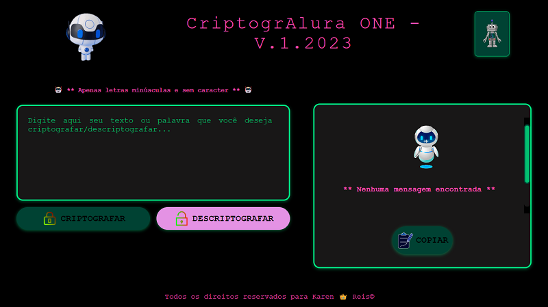

# projeto_cripto_alura



> Este projeto foi desenvolvido como parte do curso da Alura sobre criptografia de palavras. Através deste projeto, pude aplicar o conhecimento adquirido nas aulas e criar uma solução funcional para criptografar palavras.

### Ajustes e melhorias

O projeto ainda está em desenvolvimento e as próximas atualizações serão voltadas nas seguintes tarefas:

- [x] Criação;
- [x] Criando as Funcionalidades;
- [x] Testes;
- [x] Criar o gitpage;
- [ ] Melhorias para facilitar a usabilidade.

## 📕 Descrição

O Criptografador de Palavras é uma aplicação simples que permite ao usuário criptografar uma palavra de acordo com um algoritmo de criptografia escolhido. A aplicação oferece diferentes opções de algoritmos para escolha a substituição de vogais nas palavras digitadas pelos usuários, permitindo que ele utilize essa página para criar suas próprias palavras criptogradas.

## 📝 Funcionalidades

* Criptografar uma palavra ou texto: O usuário pode digitar uma palavra ou texto no campo de entrada e selecionar um algoritmo de criptografia para transformar a palavra em uma sequência criptografada.

* Algoritmos de criptografia e desciptografia disponíveis: A aplicação oferece algoritmos de criptografia, que faz a substituição das vogais com ou sem acentos e também pode utrilizar o algoritmo de descriptogarfar para ler as mensagens trocadas por outros usuários. O usuário pode escolher o algoritmo que melhor se adequa às suas necessidades.

* Visualização da palavra criptografada: Após criptografar a palavra, o usuário pode visualizar a sequência criptografada ou descriptografia na interface da aplicação.

## 💻 Pré-requisitos

Antes de começar, verifique se você atendeu aos seguintes requisitos:
<!---Estes são apenas requisitos de exemplo. Adicionar, duplicar ou remover conforme necessário--->
* Você instalou a versão mais recente de `<JavaScript>`
* Você tem uma máquina `<Windows / Linux / Mac>`. Indique qual sistema operacional é compatível / não compatível.

## 🚀 Instalando <CriptogrAlura ONE - V.1.2023>

Para instalar o <CriptogrAlura ONE - V.1.2023>, siga estas etapas:

## Como Executar o Projeto (Windows)

Windows:

1. Certifique-se de ter o Node.js e o npm (Node Package Manager) instalados em seu sistema. Você pode fazer o download do Node.js em https://nodejs.org/.

2. Abra um terminal.

3. Clone o repositório do projeto:

   ```
   git clone  https://github.com/reiskaren0228/projeto_cripto_alura.git
   ```

4. Navegue até o diretório do projeto:

   ```
   cd criptografador-palavras
   ```

5. Instale as dependências necessárias:

   ```
   npm install
   ```

6. Inicie a aplicação:

   ```
   npm start
   ```

7. A aplicação será iniciada e você poderá interagir com a interface para criptografar palavras.

## Como Executar o Projeto (Linux e macOS)

Para executar o projeto em sistemas Linux ou macOS, siga as etapas abaixo:

1. Certifique-se de ter o Node.js e o npm (Node Package Manager) instalados em seu sistema. Você pode fazer o download do Node.js em https://nodejs.org/.

2. Abra um terminal.

3. Clone o repositório do projeto:

   ```
   git clone  https://github.com/reiskaren0228/projeto_cripto_alura.git
   ```

4. Navegue até o diretório do projeto:

   ```
   cd criptografador-palavras
   ```

5. Instale as dependências necessárias:

   ```
   npm install
   ```

6. Inicie a aplicação:

   ```
   npm start
   ```

7. A aplicação será iniciada e você poderá interagir com a interface para criptografar palavras.

## Agradecimentos

Gostaria de expressar meus sinceros agradecimentos à Alura por oferecer este curso valioso sobre criptografia de palavras. As aulas foram bem estruturadas e forneceram uma base sólida para o desenvolvimento deste projeto. Também gostaria de agradecer aos instrutores e à equipe de suporte da Alura por seu suporte durante o curso, ao @danieldemoura (https://github.com/danieldemoura), aprendi muito no seu vídeo sobre o projeto e com isso conseguir corrigir meus erros e finalizar o meu. Com  ele aprendei mais ainda como executar esse projeto.

## Contribuições

Contribuições para a melhoria deste projeto são sempre bem-vindas. Se você identificar algum problema, bug ou tiver sugestões de melhorias, fique à vontade para abrir uma *issue* ou enviar um *pull request* no repositório do projeto.

## 📫 Contribuindo para <CriptogrAlura ONE - V.1.2023>

Para contribuir com <CriptogrAlura ONE - V.1.2023>, siga estas etapas:

1. Bifurque este repositório.
2. Crie um branch: `git checkout -b <nome_branch>`.
3. Faça suas alterações e confirme-as: `git commit -m '<mensagem_commit>'`
4. Envie para o branch original: `git push origin <nome_do_projeto> / <local>`
5. Crie a solicitação de pull.

Como alternativa, consulte a documentação do GitHub em [como criar uma solicitação pull](https://help.github.com/en/github/collaborating-with-issues-and-pull-requests/creating-a-pull-request).

## 😄 Seja um dos contribuidores<br>

Contribuições para a melhoria deste projeto são sempre bem-vindas. Se você identificar algum problema, bug ou tiver sugestões de melhorias, fique à vontade para abrir uma issue ou enviar um pull request no repositório do projeto.

Quer fazer parte desse projeto? Clique [AQUI](CONTRIBUTING.md) e leia como contribuir.

## Licença

Este projeto está licenciado sob a licença [MIT](https://opensource.org/licenses/MIT). Sinta-se à vontade para utilizá-lo, modificá-lo e distribuí-lo conforme necessário.

![CriptogrAlura ONE - V.1.2023]


[⬆ Voltar ao topo](# projeto_cripto_alura)<br>
